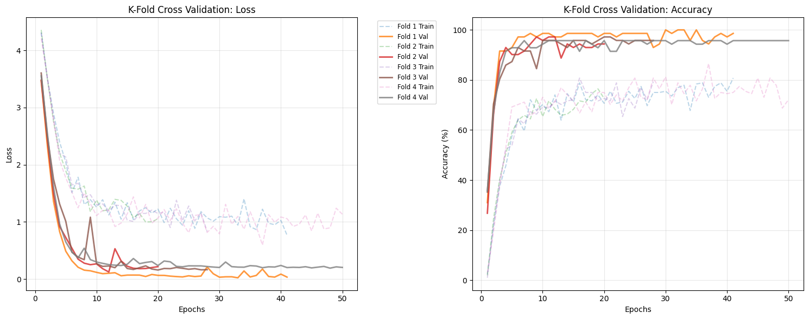
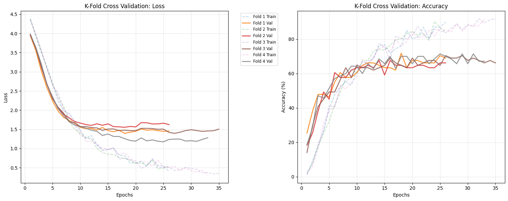
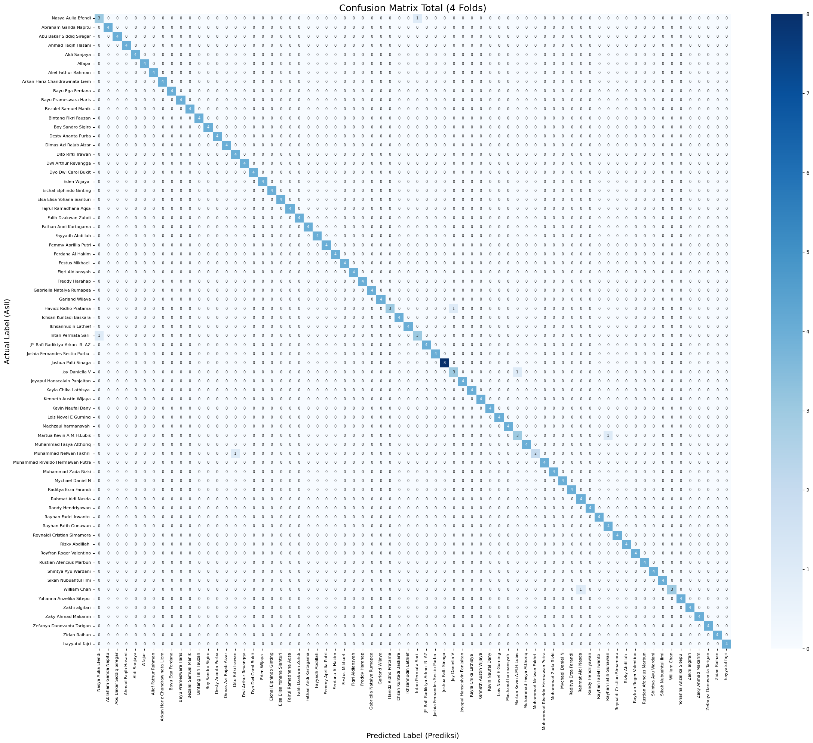
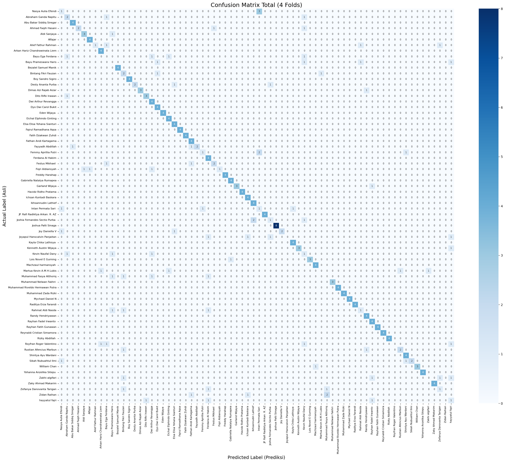

# InceptionResnetV1 dan ConvNext Tiny untuk Sistem Absensi Mahasiswa Deep Learning Berdasarkan Citra Wajah

Repositori ini mendokumentasikan pengembangan dan evaluasi sistem absensi biometrik menggunakan pendekatan *Few-Shot Learning*. Fokus utama penelitian ini adalah membandingkan kinerja antara model yang dilatih khusus pada domain wajah (**InceptionResnetV1**) dengan arsitektur CNN modern yang dilatih pada domain objek umum (**ConvNeXt-Tiny**).

## Ringkasan Proyek

* **Tujuan:** Mengembangkan model pengenalan wajah mahasiswa Deep Learning ITERA yang akurat dengan data latih terbatas (rata-rata 4 citra per individu).
* **Metode Validasi:** Stratified 4-Fold Cross Validation.
* **Dataset:** Citra wajah mahasiswa (70 Kelas, Total 283 Sampel).
* **Framework:** PyTorch.

---

## Ringkasan Hasil Evaluasi

Berdasarkan pengujian menggunakan *Cross Validation*, berikut adalah perbandingan performa rata-rata antar model:

| Model | Bobot Pre-trained | Akurasi Rata-rata | Macro F1-Score | Keterangan |
| :--- | :--- | :--- | :--- | :--- |
| **InceptionResnetV1** | **VGGFace2** | **98.00%** | **0.97** | **Model Terbaik.** Sangat stabil dan akurat. |
| ConvNeXt-Tiny | ImageNet-1K | 69.00% | 0.66 | Mengalami kesulitan generalisasi. |

### Analisis Kinerja
Perbedaan performa yang signifikan (~29%) menunjukkan bahwa untuk kasus *dataset kecil (few-shot)*, **domain pengetahuan awal (pre-trained weights)** memiliki dampak yang jauh lebih besar daripada modernitas arsitektur. InceptionResnetV1 yang telah dilatih dengan jutaan wajah (vggface2) mampu beradaptasi dengan cepat, sedangkan ConvNeXt kesulitan mempelajari fitur mikro wajah (seperti jarak mata atau bentuk rahang) hanya dari 200-an gambar.

---

## Visualisasi Hasil Pelatihan

Bagian ini menampilkan perbandingan kurva pembelajaran dan matriks kebingungan (*confusion matrix*) untuk menganalisis stabilitas dan distribusi kesalahan model.

### 1. Kurva Pembelajaran (Loss & Accuracy)

| InceptionResnetV1 (VGGFace2) | ConvNeXt-Tiny (ImageNet) |
| :---: | :---: |
|  |  |
| *Konvergensi cepat dan stabil.* | *Kesulitan konvergensi.* |

### 2. Confusion Matrix

| InceptionResnetV1 (VGGFace2) | ConvNeXt-Tiny (ImageNet) |
| :---: | :---: |
|  |  |
| *Prediksi terkonsentrasi di diagonal utama (Benar).* | *Banyak noise di luar diagonal (Salah Prediksi).* |

---

## Laporan Klasifikasi Detail

Berikut adalah laporan metrik (Precision, Recall, F1-Score) untuk setiap kelas individu dari hasil agregasi *K-Fold*.

### Model 1: InceptionResnetV1 (Akurasi: 98%)
<details>
  <summary><strong>Klik untuk melihat laporan lengkap InceptionResnetV1</strong></summary>

```text
=== AGGREGATED CLASSIFICATION REPORT (Semua Folds) ===
                                 precision    recall  f1-score   support

             Nasya Aulia Efendi       0.75      0.75      0.75         4
           Abraham Ganda Napitu       1.00      1.00      1.00         4
       Abu Bakar Siddiq Siregar       1.00      1.00      1.00         4
             Ahmad Faqih Hasani       1.00      1.00      1.00         4
                   Aldi Sanjaya       1.00      1.00      1.00         4
                        Alfajar       1.00      1.00      1.00         4
            Alief Fathur Rahman       1.00      1.00      1.00         4
 Arkan Hariz Chandrawinata Liem       1.00      1.00      1.00         4
               Bayu Ega Ferdana       1.00      1.00      1.00         4
          Bayu Prameswara Haris       1.00      1.00      1.00         4
           Bezalel Samuel Manik       1.00      1.00      1.00         4
           Bintang Fikri Fauzan       1.00      1.00      1.00         4
              Boy Sandro Sigiro       1.00      1.00      1.00         4
             Desty Ananta Purba       1.00      1.00      1.00         4
          Dimas Azi Rajab Aizar       1.00      1.00      1.00         4
              Dito Rifki Irawan       0.80      1.00      0.89         4
            Dwi Arthur Revangga       1.00      1.00      1.00         4
            Dyo Dwi Carol Bukit       1.00      1.00      1.00         4
                   Eden Wijaya        1.00      1.00      1.00         4
        Eichal Elphindo Ginting       1.00      1.00      1.00         4
     Elsa Elisa Yohana Sianturi       1.00      1.00      1.00         4
          Fajrul Ramadhana Aqsa       1.00      1.00      1.00         4
            Falih Dzakwan Zuhdi       1.00      1.00      1.00         4
          Fathan Andi Kartagama       1.00      1.00      1.00         4
               Fayyadh Abdillah       1.00      1.00      1.00         4
           Femmy Aprillia Putri       1.00      1.00      1.00         4
               Ferdana Al Hakim       1.00      1.00      1.00         4
                Festus Mikhael        1.00      1.00      1.00         4
               Fiqri Aldiansyah       1.00      1.00      1.00         4
                 Freddy Harahap       1.00      1.00      1.00         4
      Gabriella Natalya Rumapea       1.00      1.00      1.00         4
                 Garland Wijaya       1.00      1.00      1.00         4
           Havidz Ridho Pratama       1.00      0.75      0.86         4
         Ichsan Kuntadi Baskara       1.00      1.00      1.00         4
            Ikhsannudin Lathief       1.00      1.00      1.00         4
            Intan Permata Sari        0.75      0.75      0.75         4
 JP. Rafi Radiktya Arkan. R. AZ       1.00      1.00      1.00         4
 Joshia Fernandes Sectio Purba        1.00      1.00      1.00         4
            Joshua Palti Sinaga       1.00      1.00      1.00         8
                 Joy Daniella V       0.75      0.75      0.75         4
   Joyapul Hanscalvin Panjaitan       1.00      1.00      1.00         4
          Kayla Chika Lathisya        1.00      1.00      1.00         4
          Kenneth Austin Wijaya       1.00      1.00      1.00         4
              Kevin Naufal Dany       1.00      1.00      1.00         4
           Lois Novel E Gurning       1.00      1.00      1.00         4
           Machzaul harmansyah        1.00      1.00      1.00         4
       Martua Kevin A.M.H.Lubis       0.75      0.75      0.75         4
        Muhammad Fasya Atthoriq       1.00      1.00      1.00         4
        Muhammad Nelwan Fakhri        1.00      0.67      0.80         3
Muhammad Riveldo Hermawan Putra       1.00      1.00      1.00         4
            Muhammad Zada Rizki       1.00      1.00      1.00         4
               Mychael Daniel N       1.00      1.00      1.00         4
           Raditya Erza Farandi       1.00      1.00      1.00         4
              Rahmat Aldi Nasda       0.80      1.00      0.89         4
              Randy Hendriyawan       1.00      1.00      1.00         4
          Rayhan Fadel Irwanto        1.00      1.00      1.00         4
           Rayhan Fatih Gunawan       0.80      1.00      0.89         4
     Reynaldi Cristian Simamora       1.00      1.00      1.00         4
                Rizky Abdillah        1.00      1.00      1.00         4
        Royfran Roger Valentino       1.00      1.00      1.00         4
        Rustian Afencius Marbun       1.00      1.00      1.00         4
            Shintya Ayu Wardani       1.00      1.00      1.00         4
           Sikah Nubuahtul Ilmi       1.00      1.00      1.00         4
                   William Chan       1.00      0.75      0.86         4
       Yohanna Anzelika Sitepu        1.00      1.00      1.00         4
                 Zakhi algifari       1.00      1.00      1.00         4
             Zaky Ahmad Makarim       1.00      1.00      1.00         4
      Zefanya Danovanta Tarigan       1.00      1.00      1.00         4
                   Zidan Raihan       1.00      1.00      1.00         4
                 hayyatul fajri       1.00      1.00      1.00         4

                       accuracy                           0.98       283
                      macro avg       0.98      0.97      0.97       283
                   weighted avg       0.98      0.98      0.97       283
```
</details>

### Model 1: ConvNext Tiny (Akurasi: 69%)
<details>
  <summary><strong>Klik untuk melihat laporan lengkap ConvNext Tiny</strong></summary>
  
```text
=== AGGREGATED CLASSIFICATION REPORT (Semua Folds) ===
                                 precision    recall  f1-score   support

             Nasya Aulia Efendi       0.25      0.25      0.25         4
           Abraham Ganda Napitu       0.40      0.50      0.44         4
       Abu Bakar Siddiq Siregar       0.80      1.00      0.89         4
             Ahmad Faqih Hasani       1.00      0.50      0.67         4
                   Aldi Sanjaya       0.75      0.75      0.75         4
                        Alfajar       0.80      1.00      0.89         4
            Alief Fathur Rahman       1.00      0.25      0.40         4
 Arkan Hariz Chandrawinata Liem       0.67      1.00      0.80         4
               Bayu Ega Ferdana       0.00      0.00      0.00         4
          Bayu Prameswara Haris       0.00      0.00      0.00         4
           Bezalel Samuel Manik       1.00      1.00      1.00         4
           Bintang Fikri Fauzan       0.29      0.50      0.36         4
              Boy Sandro Sigiro       1.00      1.00      1.00         4
             Desty Ananta Purba       1.00      0.50      0.67         4
          Dimas Azi Rajab Aizar       1.00      0.75      0.86         4
              Dito Rifki Irawan       0.75      0.75      0.75         4
            Dwi Arthur Revangga       0.50      1.00      0.67         4
            Dyo Dwi Carol Bukit       0.67      1.00      0.80         4
                   Eden Wijaya        1.00      1.00      1.00         4
        Eichal Elphindo Ginting       0.67      1.00      0.80         4
     Elsa Elisa Yohana Sianturi       0.67      1.00      0.80         4
          Fajrul Ramadhana Aqsa       1.00      1.00      1.00         4
            Falih Dzakwan Zuhdi       1.00      1.00      1.00         4
          Fathan Andi Kartagama       0.57      1.00      0.73         4
               Fayyadh Abdillah       1.00      0.50      0.67         4
           Femmy Aprillia Putri       0.50      0.25      0.33         4
               Ferdana Al Hakim       0.44      1.00      0.62         4
                Festus Mikhael        0.67      0.50      0.57         4
               Fiqri Aldiansyah       1.00      0.25      0.40         4
                 Freddy Harahap       1.00      1.00      1.00         4
      Gabriella Natalya Rumapea       0.80      1.00      0.89         4
                 Garland Wijaya       1.00      0.75      0.86         4
           Havidz Ridho Pratama       1.00      1.00      1.00         4
         Ichsan Kuntadi Baskara       0.67      1.00      0.80         4
            Ikhsannudin Lathief       0.67      1.00      0.80         4
            Intan Permata Sari        0.17      0.25      0.20         4
 JP. Rafi Radiktya Arkan. R. AZ       1.00      1.00      1.00         4
 Joshia Fernandes Sectio Purba        0.33      0.25      0.29         4
            Joshua Palti Sinaga       1.00      1.00      1.00         8
                 Joy Daniella V       1.00      0.50      0.67         4
   Joyapul Hanscalvin Panjaitan       0.00      0.00      0.00         4
          Kayla Chika Lathisya        0.80      1.00      0.89         4
          Kenneth Austin Wijaya       1.00      0.75      0.86         4
              Kevin Naufal Dany       0.14      0.25      0.18         4
           Lois Novel E Gurning       1.00      0.75      0.86         4
           Machzaul harmansyah        0.80      1.00      0.89         4
       Martua Kevin A.M.H.Lubis       0.00      0.00      0.00         4
        Muhammad Fasya Atthoriq       0.00      0.00      0.00         4
        Muhammad Nelwan Fakhri        1.00      1.00      1.00         3
Muhammad Riveldo Hermawan Putra       1.00      1.00      1.00         4
            Muhammad Zada Rizki       1.00      1.00      1.00         4
               Mychael Daniel N       1.00      1.00      1.00         4
           Raditya Erza Farandi       1.00      1.00      1.00         4
              Rahmat Aldi Nasda       0.33      0.25      0.29         4
              Randy Hendriyawan       0.67      1.00      0.80         4
          Rayhan Fadel Irwanto        0.57      1.00      0.73         4
           Rayhan Fatih Gunawan       1.00      1.00      1.00         4
     Reynaldi Cristian Simamora       1.00      1.00      1.00         4
                Rizky Abdillah        1.00      1.00      1.00         4
        Royfran Roger Valentino       0.00      0.00      0.00         4
        Rustian Afencius Marbun       0.67      0.50      0.57         4
            Shintya Ayu Wardani       0.67      1.00      0.80         4
           Sikah Nubuahtul Ilmi       1.00      0.50      0.67         4
                   William Chan       1.00      0.75      0.86         4
       Yohanna Anzelika Sitepu        1.00      1.00      1.00         4
                 Zakhi algifari       0.00      0.00      0.00         4
             Zaky Ahmad Makarim       1.00      1.00      1.00         4
      Zefanya Danovanta Tarigan       0.33      0.25      0.29         4
                   Zidan Raihan       0.00      0.00      0.00         4
                 hayyatul fajri       0.17      0.25      0.20         4

                       accuracy                           0.69       283
                      macro avg       0.69      0.69      0.66       283
                   weighted avg       0.69      0.69      0.67       283
```
</details>
